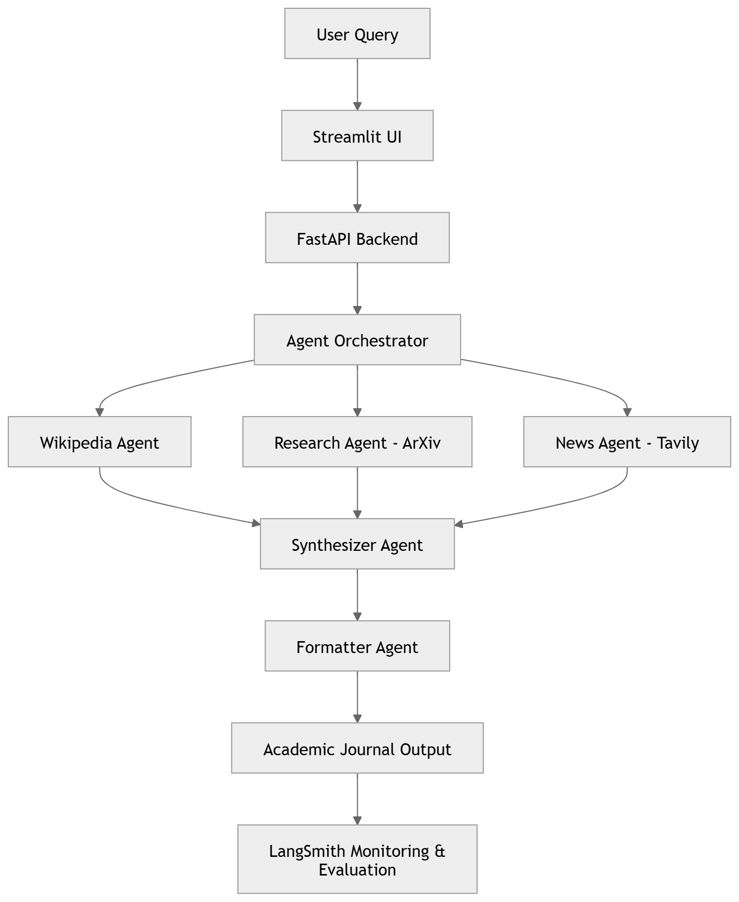

# 📚 Multi-Agent Academic Journal Generator
### Agentic AI System for Autonomous Academic Research & Journal Creation

---

## 🚀 Project Overview

The **Multi-Agent Academic Journal Generator** is an **Agentic AI application** that autonomously researches academic topics and generates structured academic journals using coordinated AI agents.

The system gathers knowledge from multiple trusted sources and synthesizes them into publication-style academic content.

Unlike traditional single-LLM applications, this system uses **multi-agent orchestration powered by LangGraph**.

---

## 🌐 Live Application

🔗 **Frontend:**  
https://multi-ai-agent-journal-by-bala.streamlit.app/

🔗 **Backend API Docs:**  
https://multi-agent-ai-journal.onrender.com/docs

---

## 🧠 Core Idea

Given an academic topic, the system:

1. Collects conceptual knowledge
2. Retrieves research papers
3. Fetches latest developments
4. Synthesizes insights
5. Formats a complete academic journal
6. Streams generation in real time

---

## 🏗️ System Architecture

---

## 🤖 Multi-Agent Workflow

### 🔎 Research Layer
- Wikipedia Knowledge Extraction
- Research Paper Retrieval
- Latest News Analysis

### 🧠 Intelligence Layer
- Information synthesis
- Academic reasoning
- Insight generation

### 📝 Formatting Layer
- Structured journal creation
- Citation organization
- Academic formatting

---

## ⚙️ Tech Stack

### AI Frameworks
- LangChain
- LangGraph
- LangSmith (LLMOps)
- Groq LLM Inference

### Backend
- FastAPI
- Streaming APIs
- Pydantic Validation

### Frontend
- Streamlit

### Model

llama-3.3-70b-versatile

### Deployment
- Render (Backend)
- Streamlit Cloud (Frontend)

---

## ✨ Key Features

✅ Multi-Agent AI Architecture  
✅ Parallel Agent Execution  
✅ Academic Knowledge Synthesis  
✅ Real-Time Streaming Generation  
✅ Automated Citation Engine  
✅ LLM-as-Judge Evaluation  
✅ LangSmith Observability  
✅ Cloud Deployment  

---

## 📊 LLMOps & Monitoring (LangSmith)

The project integrates **LangSmith** for production-grade monitoring.

### Observability
- Agent execution tracing
- Latency monitoring
- Token usage tracking
- Error analysis

### Evaluation
LLM-as-Judge evaluates journals based on:

- Topic Relevance
- Academic Depth
- Coherence
- Structure Quality
- Citation Quality

### Automated Alerts
- Low quality output detection
- High latency monitoring
- Execution failure alerts

---

## ⚡ Streaming Agent Execution

Instead of waiting for completion, users can see:

🧠 Orchestrator initialized
📚 Collecting Wikipedia knowledge
📄 Retrieving research papers
📰 Fetching latest news
🧠 Synthesizing academic insights
✅ Journal Generated

This improves transparency and user experience.

---

## 📂 Project Structure

multi-agent-academic-journal/
│
├── backend/
│ ├── main.py
│ ├── journal_graph.py
│ ├── research_agent.py
│ ├── synthesizer_agent.py
│ ├── formatter_agent.py
│ └── citation_engine.py
│
├── frontend/
│ └── app.py
│
└── README.md

---

## 🎯 Learning Outcomes

This project demonstrates:

- Agentic AI System Design
- Multi-Agent Orchestration
- Production LLM Deployment
- Streaming AI Applications
- LLM Evaluation & Monitoring
- End-to-End AI System Engineering

---

## 👨‍💻 Author

**Balasubramanya C K**

AI • Data Science • Agentic AI • LLM Systems

---

⭐ If you found this project interesting, consider giving it a star!